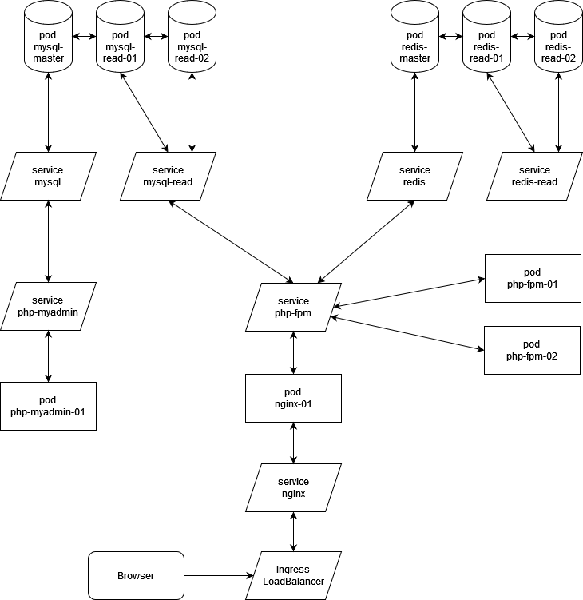

# Mastering Kubernetes

## 1. Prerequisite
Install [VirtualBox](https://www.virtualbox.org) and [Vagrant](https://www.vagrantup.com)

## 2. Installation

    mkdir mastering-kubernetes-vm
    cd mastering-kubernetes-vm
    mkdir code
    cd code
    git clone https://github.com/wajrcs-dk/mastering-kubernetes
    cp mastering-kubernetes/5-vms/single-node/Vagrantfile ../
    cd ..
    vagrant up
    vagrant ssh

### Lubuntu Desktop Installation For UI (optional)

    sudo apt-get update
    sudo apt-get install lubuntu-desktop -y
    sudo apt-get install firefox -y

### Minikube Installation

Please follow this bash script

    sh /vagrant_data/mastering-kubernetes/1-installation/minikube.sh

## 3. Example Project

Laravel Project: Nginx + PHP FPM + Mysql, using Redis for sessions and load balancer.

Please follow this bash script

    sh /vagrant_data/mastering-kubernetes/4-example-project/deploy.sh
